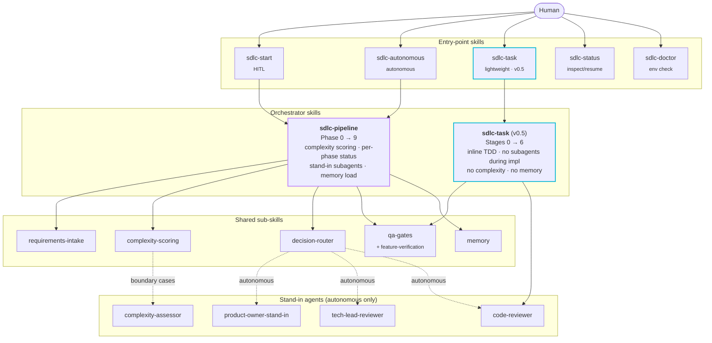
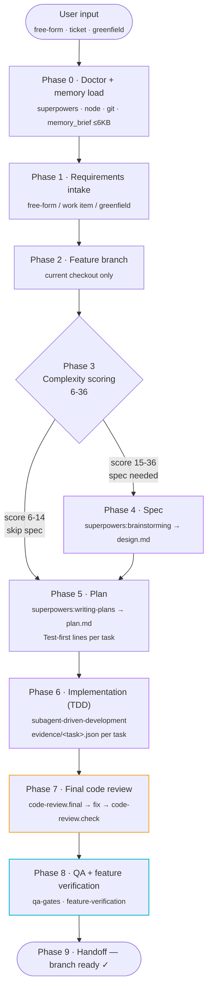
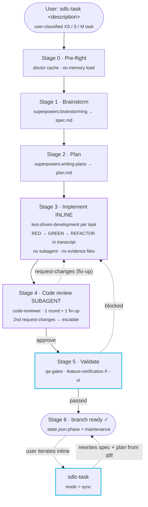
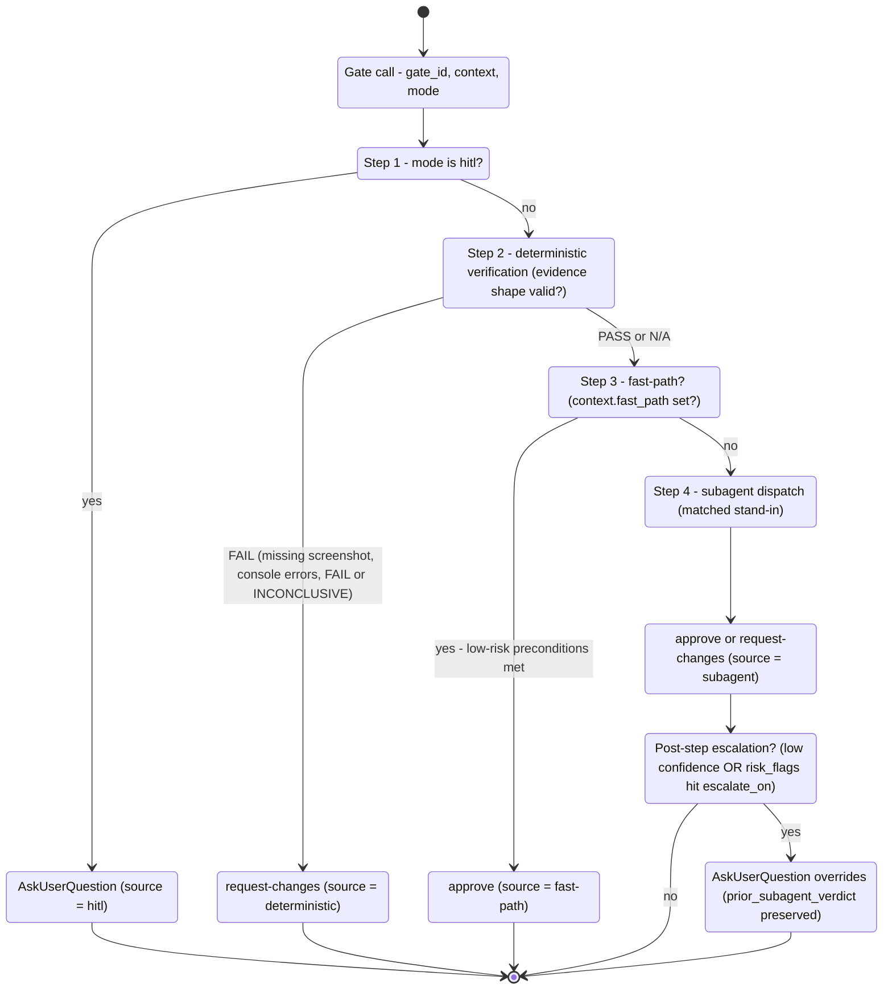

# agentic-sdlc

> **agentic-sdlc — an opinionated, skill-driven SDLC pipeline for coding agents.**

Hand it a task — loose text, a ticket reference, or just a greenfield idea — and it carries that task through spec, plan, test-driven implementation, review, QA, and functional verification. Three levels of oversight share one underlying toolkit, and every judgment call runs through cheap deterministic checks before a model is asked to weigh in.

Use the `report-builder` skill to generate the consolidated SDLC HTML view.

---

## Table of contents

- [Why this exists](#why-this-exists)
- [Three operational modes](#three-operational-modes)
- [System architecture](#system-architecture)
- [Pipeline flows](#pipeline-flows)
- [Install](#install)
- [Entry-point skills](#entry-point-skills)
- [How to use](#how-to-use)
- [How to customize](#how-to-customize)
- [What gets persisted](#what-gets-persisted)
- [Skills and agents](#skills-and-agents)
- [Decision router and quality gates](#decision-router-and-quality-gates)
- [Troubleshooting](#troubleshooting)
- [Roadmap](#roadmap)

---

## Why this exists

Left to their own devices, coding agents are strong at writing individual pieces of code but weak at running a *process*: they skip specs, plan on the fly, treat tests as an afterthought, and every task starts cold with no memory of how the team actually works.

agentic-sdlc is the process layer on top:

- **Behavior lives in skills, not one-off prompts.** Each skill (`skills/*/SKILL.md`) is a named, reusable contract. Entry-point skills stand in for host-specific slash commands, so the same workflow runs on Claude Code, Codex, or any other skill-aware host.
- **Fixed phases, deterministic artifacts.** Every run walks the same numbered sequence, and each phase writes its output to a predictable path — so a run can be resumed, audited, or replayed exactly.
- **Cheap checks before expensive ones.** A gate first tries structural verification (does the evidence have the right shape, does the diff match, does the file exist) and only reaches for a stand-in subagent when that can't settle it.
- **Tests come first, provably.** The full pipeline keeps a per-task `evidence/<task-id>.json` — the failing command, the failure output, the passing command, the passing output — and a review can't proceed until that shape checks out.
- **It stops short of merging.** All three modes end at a review-ready branch. Opening the pull request is left to a human or a dedicated PR tool.

---

## Three operational modes

| Mode | Skill | Best for | Speed | Subagents during impl |
|------|---------|----------|-------|------------------------|
| **HITL** | `sdlc-start <task>` | Production, brownfield, regulated work | You're the bottleneck | None (you decide every gate) |
| **Autonomous** | `sdlc-autonomous <task>` | Greenfield POCs, well-scoped tickets, batch runs | Claude-bound | On ambiguity, risk, or boundary scoring |
| **Task** (v0.5) | `sdlc-task <task>` | One-file changes, focused refactors, small features the user has already classified XS/S/M | Inline | One (code review only) |

`sdlc-task` is a sibling, not a replacement. Use it when you already know the work is small and the heavy machinery would be overkill. Its `mode: "sync"` entry point reconciles `spec.md` + `plan.md` with post-completion inline changes before you open a PR.

---

## System architecture



**Reading the diagram:**
- **Two orchestrators.** `sdlc-pipeline` runs the full 10-phase heavy flow; `sdlc-task` runs the lightweight 6-stage inline flow.
- **Shared sub-skills.** Both orchestrators use `qa-gates` (and `feature-verification` when UI changes). Only the heavy pipeline uses `requirements-intake`, `complexity-scoring`, `decision-router`, and `memory`.
- **Stand-in agents only in autonomous heavy flow.** The `code-reviewer` is the one exception: `sdlc-task` also dispatches it once for its single code-review round.

---

## Pipeline flows

### Heavy pipeline (`sdlc-start`, `sdlc-autonomous`)

Ten phases. Each phase writes a deterministic output to `docs/superpowers/runs/<run-id>/` for resume safety. Memory is loaded once at Phase 0 and propagated to every subagent thereafter.



**Phase-by-phase:**

| Phase | Owner skill | Output |
|-------|-------------|--------|
| 0 | inline (`.agentic/agentic-sdlc/doctor.json`) | env check cache + `memory_brief` |
| 1 | `requirements-intake` | `requirements.md` |
| 2 | inline branch setup | feature branch in the current checkout |
| 3 | heuristic-first → `complexity-scoring` | `complexity.json` + routing decision |
| 4 | `superpowers:brainstorming` *(skipped if score ≤ 14)* | `design.md` |
| 5 | `superpowers:writing-plans` | `plan.md` with `Test-first: yes/no — <test>` lines |
| 6 | `superpowers:subagent-driven-development` + `superpowers:test-driven-development` | per-task commits + `evidence/<task>.json` |
| 7 | `code-reviewer` agent | review bundle + targeted check |
| 8 | `qa-gates` + `feature-verification` | `qa-report.md` + `evidence/verification/<feature>.json` |
| 9 | inline | branch-ready message with manual `mr-creator` or PR-tool handoff |

### Lightweight task flow (`sdlc-task`)

Six stages, all inline in the current conversation except a single subagent dispatch for code review. No separate worktree, no complexity scoring, no per-task evidence files.



**Why it's faster:** the heavy pipeline dispatches one subagent per plan task during implementation (each loads project context, writes evidence). `sdlc-task` does TDD inline in the current conversation, so 0 subagent dispatches during implementation. Code review is the only model-heavy subagent call.

**Maintenance mode and sync.** After Stage 6, the task enters maintenance mode (`.state.json.phase = "maintenance"`). Subsequent functional changes in the same conversation are implemented inline and committed, but `spec.md` and `plan.md` are NOT touched live — that would create noisy churn. Instead, the skill prints `spec/plan drifted from impl - invoke sdlc-task with mode: "sync" before PR` after each new commit. When the user invokes `sdlc-task` with `mode: "sync"`, the skill reads the diff since `last_sync_commit` and rewrites both artifacts in one batch.

### Decision router (autonomous gates)

Every judgment gate in autonomous mode hits this state machine. Order is intentional: cheapest path first. Routine evidence and green verification resolve without any model call.



---

## Install

`agentic-sdlc` requires `superpowers` >= 5.0.7.

Install `superpowers` before installing `agentic-sdlc`:

```text
/plugin marketplace add obra/superpowers
/plugin install superpowers
```

### Claude Code

From any Claude Code session:

```text
/plugin marketplace add obra/superpowers
/plugin install superpowers
/plugin marketplace add https://github.com/Jarroslav/agentic-os.git
/plugin marketplace list
/plugin install agentic-sdlc@agentic-os
/plugin list
```

Use the Git clone URL ending in `.git`, not the browser URL. Claude clones the repository and reads `.claude-plugin/marketplace.json` from the repo root.

This marketplace is registered under the name `agentic-os` (see `.claude-plugin/marketplace.json`).

For local development from a clone of this repository, you can add the local marketplace path instead:

```bash
claude plugin marketplace add .
```

Then open Claude Code and run:

```text
/plugin install agentic-sdlc@agentic-os
```

### Codex CLI

From any Codex CLI session:

```text
/plugin marketplace add obra/superpowers
/plugin install superpowers
/plugin marketplace add https://github.com/Jarroslav/agentic-os.git
/plugin marketplace list
/plugin install agentic-sdlc
/plugin list
```

Use the Git clone URL ending in `.git`, not the browser URL.

Codex resolves this plugin from the same `.claude-plugin/marketplace.json`, at `./plugins/agentic-sdlc`.

For local development from a clone of this repository, use `/plugin marketplace add .` instead of the Git URL.

Codex plugin-bundled hooks require:

```toml
[features]
plugin_hooks = true
```

Add that to `~/.codex/config.toml`, restart Codex, then review the agentic-sdlc
hooks in `/plugin` or `/hooks`.

**Hard prerequisite**: the `superpowers` plugin must be installed (>= 5.0.7). The plugin's first run will halt with an install hint if it is missing.

Optional integrations (lazy-detected only when needed):
- Ticket adapter declared in `.agentic/guides/project.md` or a related integration guide
- Optional CLIs such as `gh` or `glab` when the project ticket adapter declares them

After install, verify by invoking the `sdlc-doctor` skill:

```text
sdlc-doctor
```

Expected output: green check for `superpowers`, `node`, `git`, and a freshly written `.agentic/agentic-sdlc/doctor.json`.

If Claude Code reports a different marketplace name while installing, remove that stale marketplace entry and retry:

```text
/plugin marketplace list
/plugin install agentic-sdlc@agentic-os
```

The stale-entry symptom looks like: `Failed to load marketplace "agentic-os" ... Marketplace file not found`.

---

## Entry-Point Skills

| Skill | Mode | Description |
|---------|------|-------------|
| `sdlc-start <task>` | HITL | Start a run with human approvals at every gate. |
| `sdlc-autonomous <task>` | Autonomous | Start a run that resolves gates via stand-in subagents. |
| `sdlc-task <task>` | Task | Lightweight flow for user-classified XS/S/M tasks. No complexity scoring, inline TDD, single review round, qa-gates. |
| `sdlc-task` with `mode: "sync"` | Task | Reconcile `spec.md` + `plan.md` with post-completion changes before opening a PR. |
| `sdlc-status` | — | List heavy-pipeline runs, inspect decisions, resume an interrupted run. |
| `sdlc-doctor` | — | Force re-run the environment check; rewrite `.agentic/agentic-sdlc/doctor.json`. |

### When to use which entry point

| Situation | Entry point |
|-----------|-------------|
| First time using agentic-sdlc in a repository | Run the `knowledge-foundation` skill in its required subagent context |
| Raw idea needs a story before implementation | Invoke the `product-owner` skill |
| Ticket-sized work; ambiguity expected; full audit trail wanted | `sdlc-start` |
| Ticket-sized work; low-touch automation; audit trail | `sdlc-autonomous` |
| You already know the task is XS / S / M; minimum ceremony | `sdlc-task` |
| Branch is ready and you want an MR/PR | Invoke `mr-creator` or your preferred PR tool |
| MR/PR is open and needs monitoring | Invoke the `babysit-mr` skill |
| Structural changes should update guides | Dispatch the `knowledge-harvester` agent |
| Need an HTML run report | Invoke the `report-builder` skill |

Run the `knowledge-foundation` skill before `sdlc-start` or `sdlc-autonomous`. Full SDLC runs halt if `.agentic/guides/project.md`, `.agentic/guides/standards/git-workflow.md`, or `.agentic/guides/quality-gates.md` is missing.

`sdlc-task` deliberately omits: complexity scoring, per-task subagents, per-task evidence files, two-round code review (uses one round + one fix-up + escalate), feature-verification (opt-in via `--ui`), `meta.json` / `decisions.jsonl`, memory load.

---

## How to use

### `sdlc-start` — HITL run

```text
Use the sdlc-start skill for "add SAML SSO provider with admin onboarding flow"
Use the sdlc-start skill for PROJ-12345
Use the sdlc-start skill with --greenfield "tiny note-taking CLI in Python"
```

You'll be prompted at every gate via `AskUserQuestion`. Pick at invocation; mode switching mid-flow isn't supported in v1.

### `sdlc-autonomous` — end-to-end autonomous run

```text
Use the sdlc-autonomous skill for "refactor the logger to pino with structured fields"
Use the sdlc-autonomous skill with --escalate-on security,breaking-change <task>
```

Stand-in subagents resolve gates. You're only prompted when:
- A stand-in returns `confidence: "low"`, OR
- A stand-in raises a risk flag that intersects `escalate_on` (default: `security`, `breaking-change`), OR
- A stand-in returns malformed verdicts twice in a row.

### `sdlc-task` — lightweight inline

```text
Use the sdlc-task skill for "add email validator to the signup form"
Use the sdlc-task skill with --ui "fix dashboard widget overflow on small screens"
Use the sdlc-task skill with --slug add-auth-middleware "add auth middleware that checks the session cookie"
```

Flags:
- `--slug <name>` — override the auto-derived directory name.
- `--ui` — enable `feature-verification` for user-visible surface changes.

Claude and Codex hosts always use feature branches in the current checkout. They must not create git worktrees.

After Stage 6, you can keep iterating in the conversation. When you're ready to open a PR:

```text
Use the sdlc-task skill with mode: "sync"
```

This batches all post-completion inline changes into a single rewrite of `spec.md` + `plan.md`.

### `sdlc-status` — inspect or resume

```text
Use the sdlc-status skill
```

Lists heavy-pipeline runs under `docs/superpowers/runs/`. Pick one to view its `decisions.jsonl`, `qa-report.md`, or resume if it's in a `running` state.

### `sdlc-doctor` — force env check

```text
Use the sdlc-doctor skill
```

Rewrites `.agentic/agentic-sdlc/doctor.json` ignoring the TTL and fingerprint. The same cache is consulted by `sdlc-task` at Stage 0.

---

## How to customize

Drop `.agentic/agentic-sdlc/config.json` at the repository root to override defaults. All keys are optional; absence falls back to built-in defaults.

```json
{
  "schema": 1,
  "mode_defaults": {
    "autonomous": {
      "escalate_on": ["security", "breaking-change"],
      "max_clarifying_questions_per_phase": 3
    }
  },
  "memory": {
    "role": "sdlc",
    "auto_write_on": ["spec.approved", "plan.approved", "qa.passed"]
  },
  "review": {
    "strategy": "final-two-round",
    "max_fix_rounds": 2
  },
  "feature_verification": {
    "allow_dynamic_playwright": true,
    "app_start_command": "npm run dev",
    "base_url": "http://localhost:3000"
  },
  "integrations": {
    "ticket": { "enabled": true, "adapter": "documented in .agentic/guides/project.md" },
    "github": { "enabled": true, "command": "gh" }
  },
  "doctor": {
    "ttl_days": 7
  }
}
```

**Common customizations:**

- **Tighter autonomous escalation.** Add `scope-explosion` to `escalate_on` if you want the run to pause whenever a stand-in broadens scope.
- **More aggressive clarifying questions.** Raise `max_clarifying_questions_per_phase` for ambiguous tickets; lower it for batch runs.
- **Disable memory writes.** Remove `qa.passed` from `auto_write_on` if you don't want feedback-style memories accumulating from QA retries.
- **Custom qa-gates commands.** If your project uses unusual scripts, drop a `gate-plan.json` with custom `gates[].command` values under `<run_dir>/` — `qa-gates` runs them verbatim.
- **Custom feature-verification command.** Set `feature_verification.command` for non-Playwright/Cypress browser tools.
- **Disable lazy integrations.** Set `integrations.ticket.enabled: false` to skip configured ticket-adapter lookup.

### `.gitignore` recommendations

```gitignore
# agentic-sdlc local state
.agentic/agentic-sdlc/
.agents/memory/sdlc/daily/
docs/superpowers/runs/
docs/superpowers/tasks/*/.state.json
```

Keep these checked in (they're the artifacts of your runs):
- `docs/superpowers/specs/`
- `docs/superpowers/plans/`
- `docs/superpowers/tasks/<date>-<slug>/spec.md`
- `docs/superpowers/tasks/<date>-<slug>/plan.md`

---

## What gets persisted

| Path | Owner | Purpose |
|------|-------|---------|
| `docs/superpowers/runs/<run-id>/` | heavy pipeline | `meta.json`, `requirements.md`, `complexity.json`, `design.md`, `plan.md`, `evidence/`, `review-bundle.json`, `qa-report.md`, `decisions.jsonl` |
| `docs/superpowers/tasks/<date>-<slug>/` | `sdlc-task` | `spec.md`, `plan.md`, `.state.json`, `qa-report.md`, `gate-plan.json` |
| `.agentic/agentic-sdlc/` | shared | `doctor.json` cache (TTL + fingerprint), optional `config.json` |
| `.agents/memory/sdlc/` | heavy pipeline | curated `MEMORY.md` + daily logs (read at Phase 0, written on semantic events) |

---

## Skills and agents

### Skills

| Skill | Role |
|-------|------|
| `sdlc-start` | HITL entry point. Parses task text and invokes `sdlc-pipeline` with `mode: "hitl"`. |
| `sdlc-autonomous` | Autonomous entry point. Parses task text/escalation flags and invokes `sdlc-pipeline` with `mode: "autonomous"`. |
| `sdlc-status` | Lists heavy-pipeline runs and resumes interrupted runs after explicit confirmation. |
| `sdlc-doctor` | Forces the environment check and rewrites `.agentic/agentic-sdlc/doctor.json`. |
| `sdlc-pipeline` | Heavy-flow orchestrator (Phase 0 → 9). Mode flag `hitl|autonomous` is the only point that varies. |
| `sdlc-task` (v0.5) | Lightweight-flow orchestrator (Stage 0 → 6). HITL only, no stand-ins. |
| `requirements-intake` | Normalizes free-form / external work-item / greenfield input into `requirements.md`. |
| `complexity-scoring` | Dispatches `complexity-assessor` only on boundary cases; cheap heuristics handle obvious tasks. |
| `decision-router` | 3-step resolution at every judgment gate: deterministic → fast-path → subagent. Writes `decisions.jsonl`. |
| `qa-gates` | Vendor-neutral runner detection (npm/pnpm/yarn/cargo/poetry/uv/go) and gate execution. Caches `gate-plan.json`. |
| `feature-verification` | Mandatory functional proof for user-visible changes (heavy pipeline; opt-in for `sdlc-task`). Uses existing or generated Playwright/Cypress/Storybook coverage; captures screenshots, console errors, network failures. |
| `memory` | Per-role persistent memory under `.agents/memory/<role>/`. Daily logs + curated entries. |

### Agents

| Agent | When dispatched |
|-------|-----------------|
| `product-owner-stand-in` | autonomous · gates `requirements.ambiguous`, `spec.clarification` |
| `tech-lead-reviewer` | autonomous · gates `spec.approved`, `plan.approved`, `qa.drift`, `feature.verification` |
| `code-reviewer` | autonomous heavy pipeline gates `code-review.final`, `code-review.check` · also dispatched once by `sdlc-task` |
| `complexity-assessor` | Phase 3 only — boundary cases where heuristics can't decide confidently |

---

## Decision router and quality gates

Each gate uses the same router contract (see [`skills/decision-router/SKILL.md`](./skills/decision-router/SKILL.md)). Verdicts are always one of:

- `approve` — proceed to the next phase
- `request-changes` — fix and re-submit; carries `follow_ups`
- `abort` — terminal failure; the pipeline halts

| Gate ID | When it fires | Stand-in (autonomous) | Can fast-path? |
|---------|---------------|------------------------|----------------|
| `requirements.ambiguous` | Phase 1 open questions | `product-owner-stand-in` | no |
| `spec.clarification` | Phase 4 brainstorming Qs | `product-owner-stand-in` | no |
| `spec.approved` | Phase 4 design.md approval | `tech-lead-reviewer` | no |
| `plan.approved` | Phase 5 plan.md approval | `tech-lead-reviewer` | no |
| `code-review.final` | Phase 7 full diff review | `code-reviewer` | no |
| `code-review.check` | Phase 7 targeted check after fixes | `code-reviewer` | findings-only |
| `qa.drift` | Phase 8 spec ↔ impl drift | `tech-lead-reviewer` | no |
| `feature.verification` | Phase 8 user-visible change with blocking evidence | `tech-lead-reviewer` | green evidence auto-approves |
| `qa.ready` | Phase 8 exit; all green | deterministic, no router call | always (no model) |

**Escalation rule.** Even in autonomous mode, the router escalates to the user when:
- `verdict.confidence === "low"`, OR
- `verdict.risk_flags ∩ escalate_on !== ∅`, OR
- The stand-in returned malformed JSON twice in a row.

The user-provided answer overrides the subagent verdict and is recorded with `source: "hitl"` and `prior_subagent_verdict` preserved for audit.

---

## Troubleshooting

**`sdlc-start` halts at Phase 0 with "superpowers not found".**
Install `obra/superpowers` ≥ 5.0.7 and invoke the `sdlc-doctor` skill. The pipeline reads `.agentic/agentic-sdlc/doctor.json`; if that's stale (>7 days, or different node/superpowers version) it re-checks automatically.

**A run was interrupted (Ctrl-C, crash, session closed).**
Invoke the `sdlc-status` skill. It identifies any `running` phase in `meta.json.phases[N]` and re-executes it idempotently. Outputs use deterministic paths; re-running a phase overwrites its output (never appends). Phase 6 skips already-committed tasks; Phase 7 re-detects the diff from scratch.

**Heavy pipeline keeps re-prompting the same clarifying question.**
Lower `mode_defaults.<mode>.max_clarifying_questions_per_phase` in `config.json`, or supply more detail in the original task description.

**Autonomous mode marked a UI feature as "ready" without verifying it.**
This was a v0.2 bug; v0.3+ closes it. Phase 8 invokes `feature-verification` for any user-visible surface change. If no e2e tool is configured, the run blocks with a concrete remediation instead of being marked ready. For `sdlc-task`, pass `--ui` to enable the same gate.

**`sdlc-task` sync mode says "nothing to do".**
The state file's `last_sync_commit` already equals `HEAD`. Either you haven't made any commits since the last sync (good), or your changes were uncommitted (commit them first, then sync).

**`qa-gates` doesn't know my project's runner.**
On first run, `qa-gates` asks once and caches the answer to `<run_dir>/gate-plan.json`. Edit that file (or seed it via `.agentic/agentic-sdlc/config.json`) for custom commands.

**The `code-reviewer` agent keeps returning malformed JSON.**
The router retries once with a stricter format prompt. On second failure it escalates to the user. If this happens consistently for a project, file an issue with the raw output — usually a project-specific guidance file is conflicting.

---

## Roadmap

- **V2**: adaptive mode switching mid-flow (start HITL, switch to autonomous once trust is established for a particular task class).
- **V2**: `sdlc-status` for `sdlc-task` runs (currently only the heavy pipeline is indexed).
- **V2**: native PR integration so `sdlc-task` and `sdlc-autonomous` can optionally open the PR at handoff.
- **V2**: cross-run memory promotion — surface recurring lessons from the daily logs as curated entries automatically.

---

## License

Apache-2.0.

---

## Visual overview

Invoke the `report-builder` skill to generate the full visual reference for architecture, both pipeline flows, the decision-router state machine, the TDD evidence cycle, and the resume safety lifecycle.
