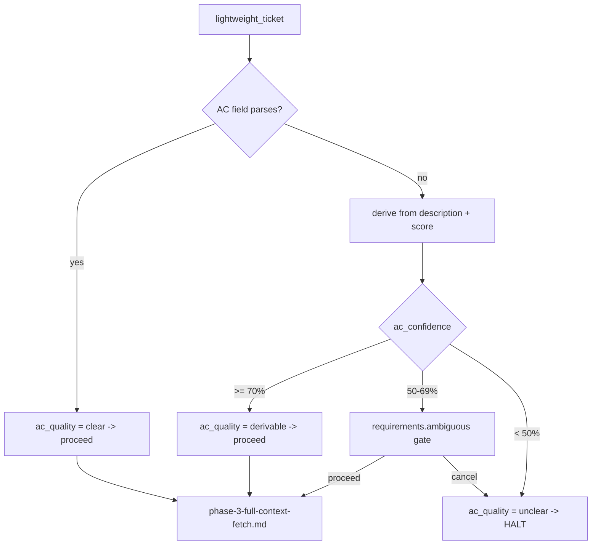

# Acceptance-Criteria Quality Gate

Shared QA-authoring reference. The QA generator skills (e.g. `qa-case-generator`) load this
before their expensive full-context fetch to answer one cheap question: **are the ticket's
acceptance criteria (AC) good enough to author tests from — or must a human fix the ticket
first?** Grade AC clarity into a confidence score, map the score to a verdict, and route the
one genuinely ambiguous band through the decision-router `requirements.ambiguous` gate.

> Run this on a minimal fetch, before you pay for comments, subtasks, and links. Vague AC
> silently poison every downstream stage — coverage math, risk scoring, generated cases. Catch
> them here, where the fix is one prompt and one re-run, not a full regeneration.

## Where the gate sits

- Reference file `phase-2-ac-quality-check.md` — after environment validation, before full
  context fetch (`phase-3-full-context-fetch.md`).
- **Blast radius:** `R0` (read-only work-item fetch) + `R1` (writes to the run's working
  state). The gate never edits the ticket — no `R2` (repo writes), no `R3` (external
  side-effects). Its only interactive surface is an optional judgment-gate prompt.
- **Grounding:** derive AC only from the fetched `title` and `description`. Never invent
  criteria that are absent from the ticket.

## Working state

Everything the gate reads or writes lives on the Phase 2 working state:

| Field | Type | Meaning |
|-------|------|---------|
| `lightweight_ticket` | object | Minimal fetch result; extracted `title`, `description`, `acceptance_criteria` |
| `acceptance_criteria_raw` | string | Raw AC field exactly as fetched |
| `acceptance_criteria` | `string[]` | Parsed (from field) or derived (from description) list |
| `ac_quality` | enum | `"clear"` \| `"missing"` \| `"derivable"` \| `"unclear"` |
| `ac_confidence` | `number` | Percentage; only meaningful when AC were derived |
| `ac_derivation_notes` | string | Partial findings recorded when derivation is weak |

## Step 1 — lightweight fetch

Fetch through the configured work-item adapter (adapter-driven; no ticket backend is
hardcoded). Pull **only** `title`, `description`, and the AC field into `lightweight_ticket`,
and stash the AC field verbatim in `acceptance_criteria_raw`. Defer everything heavier to
`phase-3-full-context-fetch.md`.

| Fetch error | Action |
|-------------|--------|
| Unknown ticket | Halt |
| Auth failure | Halt |
| Network timeout | Retry once after 10 seconds, then halt |

## Step 2 — grade the AC

### Field populated → parse (authoritative)

Split `acceptance_criteria_raw` on newlines and recognize:

- numbered items — `1.`, `AC1:`
- bullets — `-`, `*`, `•`
- an `Acceptance Criteria:` header block

Parsed items become `acceptance_criteria` and set `ac_quality = "clear"`. A populated,
parseable AC field is authoritative: no scoring, no prompt.

### Field empty / unparseable → derive

Set `ac_quality = "missing"`, then scan `description` for testable-statement patterns:

- `User should be able to...`
- `System must...`
- when / then phrasing
- Given / When / Then (Gherkin)

Extract **1–5** statements into `acceptance_criteria`. When the scan comes up thin, record
what you found in `ac_derivation_notes`.

### Score the derivation → `ac_confidence`

| Signal in the description | `ac_confidence` |
|---------------------------|-----------------|
| 3+ clear, testable statements | 80–100 |
| 1–2 vague statements | 30–60 |
| none | 0 |

## Step 3 — verdict and halt-vs-proceed

Functional constants: `>= 50%` to continue at all, `>= 70%` to skip user approval, `< 50%`
halts.

| Situation | `ac_confidence` | `ac_quality` | Outcome |
|-----------|-----------------|--------------|---------|
| AC field parsed to structured items | n/a | `"clear"` | Proceed. No gate, no prompt. |
| Derived, strong | `>= 70%` | `"derivable"` | Show derived AC, proceed automatically. |
| Derived, borderline | `50%`–`69%` | `"derivable"` | Escalate to the `requirements.ambiguous` gate. |
| Derived, weak or none | `< 50%` | `"unclear"` | Hard halt. Human fixes the ticket, then re-run. |



## The `requirements.ambiguous` escalation

The borderline band (`50%`–`69%`) is the only real judgment call — usable enough to consider,
weak enough that a human might reject it. Route it through the shared decision-router
`requirements.ambiguous` gate, which records its verdict to `decisions.jsonl` and
`events.jsonl` alongside the prior context.

In human-in-the-loop mode the gate surfaces the derived AC and the confidence via
`AskUserQuestion` with two options:

- **Proceed with derived AC** → advance to `phase-3-full-context-fetch.md`.
- **Cancel to fix the ticket first** → halt with instruction to update the ticket AC and
  re-run.

> `< 50%` never reaches the router. A judgment gate arbitrates a real choice; AC that score
> below the continue threshold leave nothing to arbitrate — they are unusable, so the gate
> halts deterministically instead of asking. Reserve the human prompt for the case where the
> answer is genuinely in doubt.

## Messages and status output

On any halt, name the ticket with `$TICKET_ID` and tell the user exactly what to do: add AC,
or rewrite the description with testable statements, then re-run `qa-case-generator`.

Clear-case one-liner:

```
✅ Acceptance criteria: clear (found <count> criteria)
```

Phase completion block:

```
✅ Phase 2: AC Quality Check
   - Ticket: $TICKET_ID (<title>)
   - Acceptance criteria: <clear|derivable|unclear> (<count> criteria found)
   - Confidence: <percentage>% (if derivable)
```

## Recovery

| Trigger | Fix | Restart |
|---------|-----|---------|
| `"unclear"` AC (`< 50%`, or gate cancelled) | Human adds AC or rewrites description with testable statements | Re-run — restarts at this stage |
| Missing QA foundation (upstream env failure) | Run the `qa-foundation` skill | Retry |

Re-runs always restart at the stage that failed, not from the top.

## Boundaries

- **Read-only for the ticket.** The gate never edits it — unclear AC are fixed by the human,
  then re-run.
- **No deep context here.** Comments, subtasks, and links belong to
  `phase-3-full-context-fetch.md`.
- **No test-design math.** Coverage formula, risk multipliers, and priority distribution live
  in `SKILL.md`; test structure lives in `test-templates.md`.

## Next

`clear` and `derivable` (approved) both hand off to `phase-3-full-context-fetch.md`.
